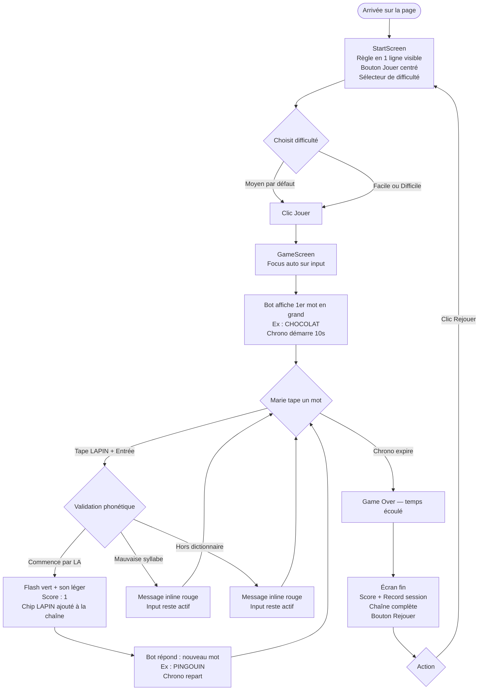
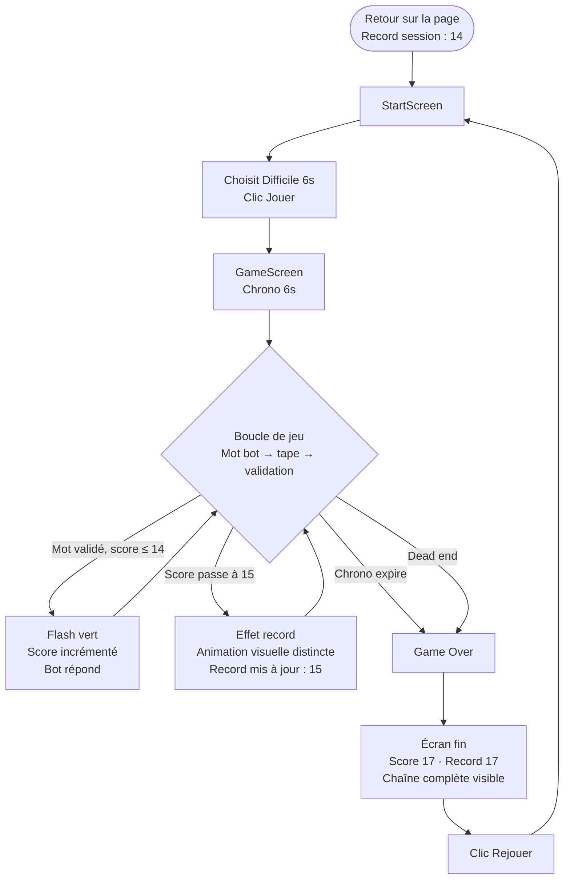
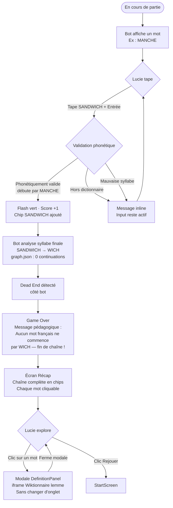
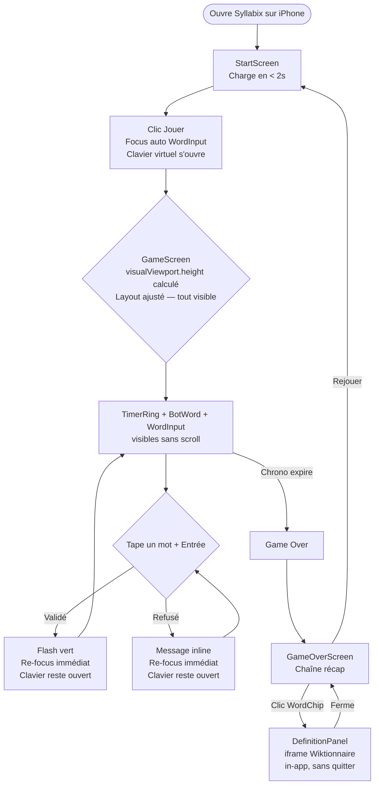

# UX Design Specification Syllabix

**Auteur :** Hugo
**Date :** 2026-03-07

---

<!-- UX design content will be appended sequentially through collaborative workflow steps -->

---

## Résumé Exécutif

### Vision Produit

Syllabix est un jeu de chaîne phonétique grand public : un humain et un bot s'enchaînent des mots en rebondissant sur la dernière syllabe phonétique du mot précédent. Règle simple, profondeur via la pression du chrono. Pas de compte, pas de dark patterns — les joueurs reviennent parce que c'est bien fait.

### Utilisateurs Cibles

- **Marie, 34 ans, prof de français** — découverte via partage social, comprend les règles en jouant sa première partie, score 6, rejoue immédiatement.
- **Thomas, 22 ans, étudiant** — cherche à battre son record de session, joue en mode Difficile (6s), l'effet visuel à chaque record est sa récompense.
- **Lucie, 28 ans, graphiste** — tombe sur un dead end phonétique, lit le message explicatif, parcourt le récap, apprend quelque chose, rejoue.

Public de référence : Semantix, Pedantix, Wordle — francophones amateurs de jeux de mots accessibles.

### Défis UX Clés

1. **Onboarding en 0 secondes** — expliquer la règle phonétique sans tutorial long.
2. **Flow sous pression chrono** — feedback immédiat (<300ms), pas de friction.
3. **Fin de partie comme rebond** — transformer la défaite en envie de rejouer.
4. **Lisibilité de la chaîne** — mot courant clair, progression visible sans surcharge.

### Opportunités Design

1. **Chaîne comme récompense visuelle** — micro-célébration à chaque mot validé.
2. **Dead end comme "wow moment"** — message mémorable qui crée de l'attachement.
3. **Récap pédagogique** — mini-session vocabulaire en fin de partie, non-intrusive.

---

## Expérience Utilisateur Core

### Expérience Définissante

L'action centrale de Syllabix est la saisie du mot réponse sous contrainte de temps. Le joueur voit le mot du bot, identifie sa dernière syllabe phonétique, tape son mot et soumet avec Entrée — avant que le chrono expire. Cette boucle est le cœur du produit : si elle est fluide, le jeu est addictif.

### Stratégie Plateforme

SPA web responsive — desktop (expérience principale, saisie clavier) et mobile (320px+, saisie tactile). Pas d'application native. Navigation exclusivement au clavier. Zéro backend, hébergement statique.

### Interactions Effortless

- **Soumission du mot** : touche Entrée — aucun bouton à cliquer
- **Démarrage de partie** : un seul clic/tap, zéro formulaire
- **Lecture du mot bot** : affiché en gros, immédiatement lisible
- **Relance** : bouton "Rejouer" unique, visible dès le game over

### Moments de Succès Critiques

1. **Première validation** — le joueur comprend la règle phonétique en jouant, sans avoir lu d'explication.
2. **Record battu** — effet visuel distinct qui marque l'accomplissement.
3. **Dead end** — message clair et mémorable qui génère de la curiosité, pas de la frustration.
4. **Récap fin de partie** — chaîne complète visible, définitions cliquables.

### Principes d'Expérience

1. **Friction zéro à l'entrée** — démarrer en un geste, comprendre en jouant.
2. **Feedback instantané** — chaque action reçoit une réponse <300ms.
3. **La défaite enseigne** — le game over est pédagogique, jamais punitif.
4. **Minimalisme fonctionnel** — rien d'affiché qui ne sert pas le jeu en cours.

---

## Réponse Émotionnelle Désirée

### Objectifs Émotionnels Principaux

- **Pendant le jeu** : acuité et légère tension positive (le chrono comme moteur, pas comme anxiété)
- **À chaque validation** : satisfaction immédiate — micro-récompense sans interruption du flux
- **Au record battu** : fierté et surprise — pic mémorable qui justifie de rejouer
- **Au dead end** : curiosité et amusement — la découverte prime sur la frustration
- **En fin de partie** : légèreté + envie naturelle de recommencer

### Parcours Émotionnel

| Moment | Émotion cible | Émotion à éviter |
|---|---|---|
| Arrivée sur la page | Curiosité, simplicité rassurante | Confusion, surcharge |
| Démarrage de partie | Impatience positive | Hésitation |
| Pendant la chaîne | Concentration, flux | Frustration, confusion |
| Validation réussie | Satisfaction, jubilation légère | Absence de feedback |
| Mot refusé | Compréhension, envie de corriger | Humiliation, injustice |
| Dead end | Surprise, curiosité | Colère, sentiment d'arnaque |
| Record battu | Fierté, excitation | Indifférence |
| Écran de fin | Légèreté, envie de recommencer | Regret, abandon |

### Implications Design

- **Acuité + flux** → UI épurée, zéro distraction, focus unique à l'écran
- **Satisfaction immédiate** → feedback visuel ET sonore sur chaque validation
- **Curiosité au dead end** → message en découverte (*"Aucun mot français..."*), pas en punition
- **Envie de recommencer** → bouton "Rejouer" proéminent, score affiché clairement

### Émotions à Éviter Absolument

- **Frustration injuste** — tout refus doit être expliqué clairement (hors dico ou mauvaise syllabe)
- **Confusion** — le joueur doit toujours savoir ce qu'on attend de lui
- **Honte** — le game over n'est jamais un échec personnel, c'est une fin de chaîne naturelle

---

## Analyse d'Inspiration UX

### Produits Inspirants Analysés

**Wordle / NY Times** — Règle apprise en 1 partie, zéro tutorial, retour visuel immédiat (couleurs), interface épurée, accessible sans compte.

**Semantix / Pedantix** — Référence directe du PRD. Zéro friction : on tape, on voit. Compteur visible en temps réel. Champ de saisie unique = toute l'attention là.

**Mini Metro / Monument Valley** — Minimalisme visuellement satisfaisant. Micro-animations signifiantes. Son = retour d'action, pas décoration.

### Patterns Transférables

**Navigation :**
- Zéro menu, SPA mono-page → déjà décidé en architecture ✅
- Sélection de difficulté sur l'écran de démarrage (avant de plonger dans le jeu)

**Interaction :**
- Entrée = soumission — aucun bouton "Valider" à cliquer ✅
- Focus automatique sur le champ de saisie dès le démarrage (zéro clic supplémentaire)
- Feedback couleur immédiat sur validation (ex. flash vert/rouge)

**Visuel :**
- Mot principal en grand centré = héros de l'écran
- Palette restreinte 2-3 couleurs max
- Typographie forte comme élément de design principal

### Anti-Patterns à Éviter

- Tutorial obligatoire avant de pouvoir jouer
- Notifications, streak, système de vies (dark patterns — rejetés dans le PRD)
- Game over sans explication du motif
- Sons omniprésents ou agressifs (son optionnel/léger)
- Score caché ou difficile à lire en cours de partie

### Stratégie d'Inspiration

**Adopter :** focus automatique input, mot centré en grand, feedback couleur immédiat sur validation, palette restreinte, son léger sur action

**Adapter :** le "ah ha" de Semantix → transformé en dead end pédagogique mémorable pour Syllabix

**Éviter :** toute mécanique créant friction ou dépendance forcée

---

## Système de Design

### Choix du Système

CSS custom via CSS Modules — zéro lib externe de composants. Cohérent avec l'architecture décidée. Parfaitement adapté à une UI ultra-minimaliste avec peu de composants distincts.

### Justification

- Solo dev, UI simple : pas besoin d'une lib de composants (MUI, Chakra, etc.)
- Contrôle total sur l'esthétique = unicité visuelle garantie
- Zéro overhead bundle lié à une lib externe
- CSS Modules déjà intégré nativement dans le starter Vite + React

### Approche d'Implémentation

- Variables CSS globales dans `src/styles/globals.css` (tokens : couleurs, espacement, typo)
- 1 famille typographique principale (Inter ou font système)
- Palette restreinte : fond neutre + 1 couleur accent + couleurs sémantiques (succès/erreur)
- CSS Modules par composant/écran pour le scoping

### Stratégie de Customisation

Cohérence assurée par les variables CSS globales consommées par tous les modules. Pas de Storybook en V1 — les composants sont peu nombreux et simples.

---

## Expérience Core — Définition Détaillée

### Expérience Définissante

> "Tape un mot qui commence par la dernière syllabe du mot proposé — avant que le temps s'écoule."

Si on nail cette interaction, tout suit. Le joueur voit un mot, réfléchit une fraction de seconde, tape, soumet avec Entrée — et la boucle recommence immédiatement.

### Modèle Mental Utilisateur

Pattern connu (Wordle, Semantix) : saisir → feedback → continuer. Les joueurs s'attendent à un champ actif dès l'arrivée, une réponse instantanée, une règle compréhensible sans tutorial. La phonétique est la nouveauté — elle se comprend en 1 exemple (*"CHOCOLAT → LA → LAPIN"*) et en 1 partie.

### Critères de Succès

- Validation <300ms, aucune attente perceptible
- Message d'erreur clair sur tout refus (hors dico / mauvaise syllabe)
- Focus auto sur l'input après chaque validation (flux continu sans clic parasite)
- Jamais de sentiment d'injustice sur un refus

### Patterns UX

Interaction établie (saisir → Entrée → feedback) + twist phonétique. Pas de nouveau paradigme à apprendre — la règle est affichée en une ligne, le reste se comprend en jouant.

### Mécanique du Tour de Jeu

| Étape | Ce qui se passe | Design |
|---|---|---|
| **Initiation** | Bot affiche un mot en grand | Mot centré, gros, typographie forte |
| **Interaction** | Joueur tape + Entrée (focus auto) | Input en dessous, focus immédiat |
| **Feedback succès** | Flash visuel + son léger + nouveau mot bot | Animation courte, pas de blocage |
| **Feedback erreur** | Message inline court sous l'input | Champ reste actif, message disparaît vite |
| **Dead end** | Game over + message pédagogique | Transition vers récap |
| **Completion** | Écran fin : score + record + chaîne + Rejouer | Bouton proéminent |

---

## Fondation Visuelle

### Système de Couleurs — Thème Dark

```css
--color-bg:        #0f0f0f;   /* fond principal */
--color-surface:   #1a1a1a;   /* surfaces élevées (input, cartes) */
--color-text:      #f0f0f0;   /* texte principal */
--color-muted:     #6b7280;   /* texte secondaire, chrono bas */
--color-accent:    #6366f1;   /* indigo — actions, focus, accent */
--color-success:   #22c55e;   /* validation réussie */
--color-error:     #ef4444;   /* refus, game over */
--color-border:    #2d2d2d;   /* bordures subtiles */
```

**Rationale :** fond sombre = ambiance jeu, met les mots en valeur, réduit la fatigue oculaire. Indigo = caractère sans agressivité. Palette sémantique claire (vert/rouge) pour les feedbacks.

### Système Typographique

**Font pairing — identité "jeu culturel" :**

- **Display** : `Fraunces` (Google Fonts, variable optique) — titre Syllabix + mot du bot. Caractère littéraire et joueur, rare dans l'espace web apps → différenciation immédiate. Fallback : `Georgia, serif`.
- **UI** : `Inter` (Google Fonts) — tout le reste (input, score, chrono, messages, labels). Fallback : `system-ui, sans-serif`.

**Échelle typographique :**
- **Titre Syllabix** : `Fraunces`, `1.5rem`, `font-weight: 700`, couleur `--color-accent`
- **Mot du bot** : `Fraunces`, `clamp(2.5rem, 8vw, 5rem)`, `font-weight: 700` — héros de l'écran
- **Input joueur** : `Inter`, `1.25rem` — confortable à lire en tapant
- **Score / Chrono** : `Inter`, `1rem`, `font-variant-numeric: tabular-nums` (pas de jitter)
- **Messages** : `Inter`, `0.875rem`, couleur sémantique (success/error/muted)
- **Règle du jeu** : `Inter`, `0.875rem`, couleur muted, discret

**Chargement :** `display=swap` sur les deux polices — jamais de FOUT bloquant.

### Espacement & Layout

- **Base** : 8px (multiples de 8 pour tout l'espacement)
- **Layout** : colonne unique centrée, `max-width: 640px`, `padding: 0 1rem`
- **Densité** : aérée — le mot bot respire, l'input a de l'espace
- **Responsive** : même structure mobile/desktop via `clamp()` sur les tailles

### Accessibilité

- Contraste texte principal (`#111` sur `#fafafa`) : ratio ~19:1 ✅ (WCAG AAA)
- Contraste accent (`#d97706` sur `#fafafa`) : ratio ~3.8:1 — utilisé pour les éléments non-textuels (chrono SVG, bordures) ; texte accent sur fond coloré clair ✅
- Font size minimum 16px sur mobile ✅
- Focus visible sur tous les éléments interactifs (outline amber)

---

## Direction Design

### Directions Explorées

6 directions visuelles évaluées (layout Arcade × thème Light × 6 accents : Indigo, Emerald, Orange, Rose, Sky, Amber). Showcase interactif généré dans `ux-design-directions.html`.

### Direction Retenue

**Layout Arcade · Thème Light · Accent Amber**

- **Structure** : chrono circulaire SVG proéminent, mot du bot centré en gros, chaîne visible comme chips, input en bas
- **Fond** : blanc cassé `#fafafa` / surfaces `#f7f7f5`
- **Accent** : Amber `#d97706` — chaleureux, original dans l'espace word games, lisible sur fond clair
- **Texte** : `#111` (quasi-noir)

### Palette Finale Verrouillée

```css
--color-bg:       #fafafa;
--color-surface:  #f7f7f5;
--color-text:     #111111;
--color-muted:    #9ca3af;
--color-accent:   #d97706;   /* amber */
--color-accent-bg:#fffbeb;   /* amber très clair — hover/sélection */
--color-border:   #e0e0e0;
--color-success:  #16a34a;
--color-error:    #dc2626;
```

### Rationale

Amber = chaleur + accessibilité + différenciation dans un espace dominé par le bleu/violet. La structure Arcade (chrono circulaire + chaîne visible) renforce le sentiment de progression et la transparence du jeu.

### Direction Artistique — Contrainte Non Négociable

**Objectif :** Syllabix doit ressembler à un objet culturel fait main, pas à une application SaaS.

**Référentiel :** Pedantix / Semantix — editorial, sobre, typographié, sans chrome d'interface générique.

**Ce qui crée l'identité "jeu culturel" :**
- `Fraunces` sur le titre et le mot du bot — la typographie EST le design principal
- Fond `#fafafa` + surface `#f7f7f5` — presque blanc, papier, pas d'écran
- Accent amber `#d97706` utilisé avec parcimonie — uniquement sur les éléments clés (chrono, focus, bouton primaire)
- Zéro gradient, zéro ombre portée marquée, zéro glassmorphisme
- Pas de logo complexe — le nom "Syllabix" en `Fraunces` + accent amber EST le logo
- Interfaces vides plutôt que remplies : chaque élément affiché a une raison d'être

**Ce qu'il faut éviter absolument :**
- Border-radius > 8px sur les conteneurs principaux (carte-SaaS)
- Boutons avec icônes inutiles
- Header/navbar visible pendant le jeu
- Animations "app" (skeleton loaders, spinners)
- Toute couleur de fond autre que les tokens définis

---

## User Journey Flows

### Parcours 1 — Première Visite (Marie)

Marie, 34 ans, prof de français, arrive depuis un lien partagé sur Twitter. Elle n'a jamais joué à Syllabix. La règle doit se comprendre en jouant.



**Moments clés :**
- La règle se comprend en 1 coup : CHOCOLAT → LA → LAPIN
- Focus automatique : zéro clic parasite dès le début de partie
- Refus inline : l'input reste actif, pas de blocage

---

### Parcours 2 — Bonne Session (Thomas)

Thomas, 22 ans, étudiant, revient jouer. Record session : 14. Il veut le dépasser en mode Difficile (6s).



**Moments clés :**
- L'effet record est mémorable et non-intrusif — le flux ne s'arrête pas
- localStorage : record persiste sans compte
- Mode Difficile : la pression vient du temps, pas de la complexité des règles

---

### Parcours 3 — Dead End Phonétique (Lucie)

Lucie, 28 ans, graphiste, joue normalement, puis propose un mot créant un cul-de-sac phonétique.



**Moments clés :**
- Dead end = découverte, pas punition → ton informatif, pas accusateur
- Récap = micro-session apprentissage passive
- L'effet "wow, je savais pas ça" est le pic mémorable de ce parcours

---

### Parcours 4 — Mobile (Camille)

Camille, 26 ans, joue depuis son iPhone. Contrainte critique : tout doit tenir dans le viewport avec le clavier ouvert.



**Moments clés :**
- Le clavier reste affiché sans interruption sur toute la partie
- Aucun scroll requis — `visualViewport` API gère l'espace disponible
- Les définitions s'ouvrent in-app — la session n'est pas interrompue

---

### Journey Patterns

**Pattern de validation inline :**
- Tout refus → message sous l'input, champ reste actif, aucun blocage
- Pas de modale ni popup : la correction est immédiate

**Pattern de feedback positif :**
- Flash visuel + son léger → non-intrusif, non-bloquant
- Le flux de jeu n'est jamais interrompu par un feedback succès

**Pattern de fin de partie :**
- Toujours vers un écran de récap informatif, jamais vers une page vide
- Bouton "Rejouer" proéminent, premier élément d'action visible

**Pattern d'entrée :**
- Focus auto input dès le début de partie → zéro clic parasite
- Soumission exclusivement par Entrée → pas de bouton "Valider"

---

### Flow Optimization Principles

1. **Chemin critique = 2 actions** : arrivée → clic Jouer → tape + Entrée. Rien de plus avant le jeu.
2. **Erreurs récupérables** : tout refus laisse l'input actif — corriger sans recommencer.
3. **Record discret** : l'effet est visible mais ne bloque pas le flux de jeu.
4. **Dead end comme narrative** : présenté comme un événement intéressant, pas comme un échec.
5. **Récap toujours explorable** : chaîne complète + définitions à portée de clic en fin de partie.

---

## Component Strategy

### Design System Components

Syllabix utilise **CSS Modules custom + CSS tokens globaux** — zéro lib externe. Tous les composants sont sur-mesure, mais s'appuient sur une base tokens solide (`globals.css`) qui assure la cohérence.

**Tokens disponibles pour tous les composants :**
- Couleurs : `--color-bg`, `--color-surface`, `--color-text`, `--color-accent`, `--color-success`, `--color-error`, `--color-muted`, `--color-accent-bg`, `--color-border`
- Typographie : Inter, échelle définie (`clamp()`, `1.25rem`, `0.875rem`)
- Espacement : base 8px, `max-width: 640px`

---

### Custom Components

#### `TimerRing`
**Purpose :** Chrono circulaire SVG — pièce maîtresse du layout Arcade.
**Usage :** GameScreen, centré en haut.
**Anatomy :** Cercle SVG animé via `stroke-dashoffset`, valeur numérique au centre.
**States :**
- `idle` — plein, couleur accent amber
- `ticking` — arc se rétrécit en temps réel via `requestAnimationFrame`
- `warning` — couleur passe à `--color-error` sous 30% du temps restant
- `expired` — flash rouge, déclenchement game over
**Accessibilité :** `role="timer"`, `aria-live="polite"`, valeur texte lisible par screenreader.

#### `BotWord`
**Purpose :** Affiche le mot actuel proposé par le bot — héros visuel de l'écran.
**Usage :** GameScreen, centré entre TimerRing et input.
**Anatomy :** Texte `clamp(2.5rem, 8vw, 5rem)`, gras, couleur `--color-text`.
**States :** `display` (statique) · `entering` (fondu/slide à chaque nouveau mot)
**Accessibilité :** `aria-live="assertive"`, `aria-label="Mot du bot : [MOT]"`.

#### `WordInput`
**Purpose :** Champ de saisie du joueur — seul élément interactif pendant le jeu.
**Usage :** GameScreen, bas du layout.
**Anatomy :** `<input type="text">`, soumission par Entrée uniquement.
**States :**
- `default` — bordure `--color-border`, background `--color-surface`
- `focused` — outline amber `--color-accent`
- `success` — flash vert 150ms, champ vidé, re-focus automatique
- `error` — flash rouge 150ms
- `disabled` — pendant transitions bot / game over
**Accessibilité :** `autofocus`, `aria-label="Tape ton mot"`, re-focus après validation.

#### `ErrorMessage`
**Purpose :** Feedback inline sur un mot refusé — non-bloquant, temporaire (2s).
**Usage :** Sous le `WordInput`.
**Anatomy :** Texte `0.875rem`, couleur `--color-error`, pas de fond ni modale.
**States :** `hidden` (opacity 0) · `visible` (slide-down + fade-in, message contextuel)
**Accessibilité :** `role="alert"`, `aria-live="assertive"`.

#### `WordChain`
**Purpose :** Progression de la chaîne en chips scrollable.
**Usage :** GameScreen (bande entre BotWord et input) + GameOverScreen (chaîne complète).
**Anatomy :** Liste horizontale de `WordChip`, scrollable, dernier chip visible.
**States :** `growing` (nouveau chip avec animation) · `complete` (récap, chips cliquables)
**Accessibilité :** `role="list"`, `aria-label="Chaîne de mots"`.

#### `WordChip`
**Purpose :** Représente un mot individuel dans la chaîne.
**Usage :** Enfant de `WordChain`.
**Anatomy :** Pill (border-radius 999px), fond `--color-accent-bg`, texte `--color-text`.
**States :** `default` · `latest` (amber plus marqué) · `clickable` (récap, hover + définition)
**Accessibilité :** `role="button"` si cliquable, `aria-label="[MOT] — voir définition"`.

#### `ScoreDisplay`
**Purpose :** Score courant + record de session en temps réel.
**Usage :** GameScreen, coin supérieur.
**Anatomy :** Deux valeurs numériques `tabular-nums`, labels muted.
**States :** `default` · `record-beat` (animation subtile sur la valeur record)
**Accessibilité :** `aria-live="polite"` sur la valeur score.

#### `RecordBurst`
**Purpose :** Effet visuel distinct quand le joueur bat son record — pic mémorable.
**Usage :** GameScreen, overlay temporaire 1.5s non-bloquant.
**Anatomy :** Message court + animation CSS (scale + fade), centré.
**States :** `hidden` · `burst` (entrée + maintien 1s + sortie)
**Accessibilité :** `role="status"`, `aria-live="polite"`.

#### `DifficultySelector`
**Purpose :** Sélection du mode de jeu avant de démarrer.
**Usage :** StartScreen uniquement.
**Anatomy :** 3 boutons radio stylisés (Facile · Moyen · Difficile), Moyen par défaut.
**States :** `default` (bordure subtile) · `selected` (fond `--color-accent-bg`, bordure amber) · `hovered`
**Accessibilité :** `role="radiogroup"`, `aria-label="Mode de difficulté"`, navigation clavier.

#### `DeadEndMessage`
**Purpose :** Message pédagogique en cas de dead end phonétique.
**Usage :** GameOverScreen, en évidence avant la chaîne récap.
**Anatomy :** Zone fond `--color-accent-bg`, bordure amber, syllabe problématique en gras.
**Accessibilité :** `role="status"`.

#### `DefinitionPanel`
**Purpose :** Définition d'un mot du récap — affichée in-app sans quitter ni changer d'onglet.
**Usage :** GameOverScreen, déclenchée par clic sur un `WordChip`.
**Anatomy :** Modale avec iframe Wiktionnaire + bouton fermeture. Le joueur consulte la page Wiktionnaire du lemme du mot sans naviguer.

**Stratégie lemme :** l'URL Wiktionnaire pointée est toujours le **lemme** du mot (forme de base), jamais la forme fléchie. Ex : "chantions" → `https://fr.wiktionary.org/wiki/chanter`. La résolution lemme → URL est gérée côté applicatif (lookup dictionnaire ou table de lemmatisation simple).

**States :**
- `hidden` — pas de DOM rendu
- `loading` — iframe en cours de chargement (spinner discret)
- `open` — iframe visible, contenu Wiktionnaire affiché

**Anatomy détaillée :**
```
┌─────────────────────────────────┐
│  Définition : LAPIN         [×] │
│ ─────────────────────────────── │
│  [iframe fr.wiktionary.org/...] │
│  (hauteur fixe, scrollable)     │
│ ─────────────────────────────── │
│  [Ouvrir sur Wiktionnaire ↗]    │  ← escape hatch optionnel
└─────────────────────────────────┘
```

**Accessibilité :** `role="dialog"`, `aria-modal="true"`, focus trap sur ouverture, `Escape` pour fermer, `aria-label="Définition de [MOT]"`.

**Fallback :** si l'iframe échoue à charger (réseau, CSP), afficher un bouton "Ouvrir sur Wiktionnaire" qui ouvre un nouvel onglet — jamais de page vide.

---

### Component Implementation Strategy

- Chaque composant : fichier React `.tsx` + `*.module.css` scopé
- Tokens `globals.css` = unique source de vérité couleur/typo/espacement
- Zéro prop de style inline — tout via classes CSS Modules
- Animations : `@keyframes` CSS Modules uniquement, respecte `prefers-reduced-motion`

---

### Implementation Roadmap

**Phase 1 — Core loop (jeu jouable)**
- `StartScreen` + `DifficultySelector`
- `TimerRing` (SVG + `requestAnimationFrame`)
- `BotWord`
- `WordInput` (focus auto, Entrée = submit)
- `ScoreDisplay`
- `ErrorMessage`
- `GameScreen` layout

**Phase 2 — Expérience complète**
- `WordChain` + `WordChip` (in-game)
- `RecordBurst`
- `GameOverScreen` + `DeadEndMessage`
- `WordChip` cliquable (récap)

**Phase 3 — Finition**
- `DefinitionPanel`
- Micro-animations (chip entering, BotWord entering)
- Son léger sur validation

---

## UX Consistency Patterns

### Hiérarchie des Actions

Syllabix n'a que 2 niveaux d'actions :

**Action primaire** (une seule visible à la fois) :
- StartScreen → bouton **"Jouer"**
- GameOverScreen → bouton **"Rejouer"**
- Style : fond `--color-accent` (#d97706), texte blanc, `min-width: 160px`, `padding: 12px 32px`, `font-weight: 600`, `border-radius: 8px`
- Hover : `brightness(1.1)`, transition 150ms
- Focus : outline 2px `--color-accent`, offset 2px

**Action secondaire** (sélection, fermeture) :
- `DifficultySelector` — 3 boutons de même taille
- Fermeture `DefinitionPanel`
- Style : fond transparent, bordure `--color-border`, texte `--color-text`
- Sélectionné : fond `--color-accent-bg`, bordure `--color-accent`

**Règle absolue :** jamais deux actions primaires visibles simultanément.

---

### Feedback Patterns

| Situation | Signal visuel | Signal sonore | Durée | Bloquant ? |
|---|---|---|---|---|
| Mot validé | Flash vert sur input + chip ajouté | Son léger (tick) | 150ms | Non |
| Mot refusé | Flash rouge sur input + `ErrorMessage` | Son court (buzz) | 150ms + 2s msg | Non |
| Record battu | `RecordBurst` overlay | Son distinct | 1.5s | Non |
| Chrono warning | `TimerRing` passe en rouge | — | Continu | Non |
| Game over | Transition vers GameOverScreen | — | Immédiat | — |
| Dead end | `DeadEndMessage` prominent | — | Permanent | — |

**Règle :** aucun feedback ne suspend le flux de jeu. Le joueur peut toujours taper sa prochaine réponse.

**Son optionnel :** léger, jamais > 300ms. Désactivable en phase 2.

---

### Form Patterns

Syllabix n'a qu'un seul champ de saisie actif :

- `autofocus` au démarrage de partie — zéro clic requis
- Re-focus automatique après chaque validation (succès ou erreur)
- Soumission exclusivement par `Enter` — pas de bouton "Valider"
- Champ vidé après validation réussie
- Champ conservé (texte sélectionné) après validation échouée → correction immédiate
- Attributs : `inputmode="text"`, `autocomplete="off"`, `autocorrect="off"`, `spellcheck="false"`

**Messages d'erreur :**
- Toujours sous le champ, jamais au-dessus
- Maximum 1 message à la fois
- 2 messages possibles : "Mot non reconnu dans le dictionnaire" / "Ne commence pas par [SYLLABE]"
- Disparaît après 2s ou dès que le joueur tape le premier caractère suivant

---

### Navigation Patterns

SPA mono-page sans routing — navigation = transitions d'état React.

**États :**
```
idle (StartScreen) → playing (GameScreen) → game-over (GameOverScreen) → idle
```

**Transitions :**
- `idle → playing` : bouton "Jouer" → immédiat, pas d'animation longue
- `playing → game-over` : chrono expire ou dead end → fade 200ms
- `game-over → idle` : bouton "Rejouer" → reset état, retour StartScreen

**Règles :**
- Pas de bouton "retour" — le seul retour est "Rejouer"
- Refresher la page = retour à `idle` (pas de `pushState`)

---

### États de Chargement

Au démarrage, `dictionary.json` et `graph.json` sont chargés en parallèle :
- Si chargement > 300ms : message discret *"Chargement du dictionnaire…"* (texte muted, centré)
- Bouton "Jouer" désactivé jusqu'à chargement complet
- En pratique imperceptible sur CDN — état de chargement = garde-fou

---

### Overlay & Panel Patterns

**`RecordBurst` (overlay non-bloquant) :**
- `pointer-events: none` — le joueur continue à taper pendant l'animation
- Pas de backdrop sombre

**`DefinitionPanel` (modale iframe, GameOverScreen uniquement) :**
- S'ouvre en modale centrée avec iframe Wiktionnaire (lemme du mot)
- Un seul panel ouvert à la fois
- Fermeture : clic sur la croix, `Escape`, ou clic sur le backdrop
- L'utilisateur ne quitte pas l'application — aucun changement d'onglet
- Fallback si iframe KO : bouton "Ouvrir sur Wiktionnaire" (nouvel onglet)

**Règle globale :** aucune modale ne bloque le retour à la partie.

---

### Micro-interactions

**Timing standards :**
- Transitions UI : 150–200ms ease-out
- `RecordBurst` : 300ms entrée + 900ms maintien + 300ms sortie
- Messages d'erreur : 200ms fade-in, auto-disparition 2s
- Chip entrant dans la chaîne : 150ms scale + fade-in

**`prefers-reduced-motion` :**
- Toutes les animations : `@media (prefers-reduced-motion: no-preference)`
- Fallback : affichage direct, fonctionnalité intacte

---

## Responsive Design & Accessibility

### Responsive Strategy

**Approche : mobile-first, mono-colonne, un seul layout.**

La structure Arcade (colonne centrée, max-width 640px) fonctionne identiquement sur mobile et desktop. Les adaptations sont des ajustements de taille et de comportement — pas de restructuration de layout.

**Mobile (320px → 639px) :**
- `TimerRing` : légèrement réduit
- `BotWord` : `clamp(2.5rem, 8vw, 4rem)`
- `WordInput` : `min-height: 52px`, `font-size: 1rem` (≥16px — évite le zoom auto iOS)
- `DifficultySelector` : boutons en colonne sur < 380px, en ligne sinon
- `WordChain` : scroll horizontal natif, `-webkit-overflow-scrolling: touch`
- Bouton "Jouer" / "Rejouer" : `width: 100%`
- Pas de `:hover` actif (non fiable sur tactile)

**Desktop (640px+) :**
- Centré dans la fenêtre, `max-width: 640px`
- `BotWord` : `clamp(3rem, 8vw, 5rem)`
- `WordInput` : `min-width: 360px`, `font-size: 1.25rem`
- Bouton "Jouer" / "Rejouer" : `min-width: 160px`, centré
- `:hover` et `:focus` actifs
- Navigation clavier complète (Tab, Enter, Escape)

**Tablet (480px–767px) :** comportement desktop appliqué dès 480px.

---

### Mobile — Contraintes Critiques (Viewport & Clavier)

#### Problème

Sur mobile, le clavier virtuel réduit le viewport disponible. Sans gestion explicite :
- Le `TimerRing` (en haut) sort du viewport visible → joueur aveugle sur le chrono
- Le scroll devient possible → rupture de flux
- Le clavier se referme si le focus est perdu → friction majeure

#### Contrainte Fondamentale

**Pendant une partie, tous les éléments actifs (chrono, mot bot, input, score) doivent tenir dans la zone visible sans aucun scroll.**

#### Solution — `visualViewport` API

```js
// Hauteur disponible après affichage du clavier virtuel
const availableHeight = window.visualViewport.height;
// Appliquer au conteneur de jeu
gameContainer.style.height = `${availableHeight}px`;
```

Le composant `GameScreen` écoute `visualViewport.resize` et ajuste sa hauteur en temps réel. Le layout interne s'adapte via `flex + gap` proportionnel à la hauteur disponible.

**Implémentation :**
- `GameScreen` : `height: 100dvh` par défaut, overridé par `visualViewport.height` sur `resize`
- Layout interne : `display: flex; flex-direction: column; justify-content: space-between`
- `TimerRing` : taille fixe (ne se compresse pas)
- `BotWord` : `clamp()` — se compresse légèrement si hauteur contrainte
- `WordChain` : `max-height` limité, overflow horizontal scroll uniquement
- `WordInput` : ancré en bas, toujours visible

#### Persistance du Clavier

Le clavier virtuel se referme si le `WordInput` perd le focus. **Il ne doit jamais perdre le focus pendant une partie.**

**Règles :**
- Re-focus `WordInput` immédiatement après chaque validation (succès ou erreur)
- Aucun autre élément ne prend le focus pendant `playing` (tous en `tabindex="-1"`)
- Pas de `blur()` programmatique pendant `playing`
- Sur iOS : utiliser `inputRef.current.focus()` dans un `setTimeout(0)` pour contourner les restrictions WebKit

**Testing obligatoire :**
- iPhone Safari réel (pas simulateur) : clavier visible en continu sur 10 mots enchaînés
- Android Chrome : idem
- Vérifier que `TimerRing` reste visible avec le clavier ouvert sur 320px de large

---

### Breakpoint Strategy

Un seul breakpoint significatif, mobile-first :

```css
/* Base = mobile (320px+) */

@media (min-width: 640px) {
  /* Ajustements desktop */
}

@media (max-width: 380px) {
  /* Très petits écrans : DifficultySelector en colonne, TimerRing réduit */
}
```

`clamp()` gère la majorité des adaptations typographiques sans media query.

---

### Accessibility Strategy

**Cible : WCAG 2.1 niveau AA**

**Contrastes :**
- Texte principal `#111` sur `#fafafa` : ~19:1 ✅ (AAA)
- Texte muted `#9ca3af` sur `#fafafa` : ~2.9:1 — uniquement pour labels non-essentiels ⚠️ à surveiller
- Accent `#d97706` sur `#fafafa` : ~3.5:1 — uniquement pour éléments graphiques non-textuels ✅ AA non-text

**Touch targets (mobile) :**
- Tous les éléments tapables : `min-height: 44px`, `min-width: 44px`
- `WordChip` en récap : padding suffisant pour atteindre 44px

**Focus clavier :**
- Outline visible : 2px `--color-accent`, offset 2px — sur tous les éléments interactifs
- Jamais `outline: none` sans alternative visible
- Pendant le jeu : seul le `WordInput` est dans l'ordre de tabulation (`tabindex="-1"` sur les autres)
- Ordre Tab logique : top → bottom

**Sémantique HTML :**
- `<main>` pour le contenu principal
- `<h1>` pour le titre de l'application
- Éléments interactifs = vrais `<button>` (jamais `<div onClick>`)
- `<input type="text">` pour la saisie

**Viewport meta :**
```html
<meta name="viewport" content="width=device-width, initial-scale=1, maximum-scale=5">
```
`maximum-scale=5` — zoom utilisateur autorisé. Zoom iOS évité via `font-size ≥ 16px` sur l'input.

---

### Testing Strategy

**Responsive :**
- Chrome DevTools : 320px, 375px, 414px, 768px, 1024px
- Safari iOS (iPhone réel si disponible) — comportement focus input critique
- Vérification : `WordInput` focus + clavier virtuel ne cachent pas le `BotWord`

**Accessibility :**
- `axe` browser extension — zéro violation "critical" ou "serious" avant merge
- VoiceOver (macOS/Safari) : navigation clavier seule + lecture des `aria-live`
- Test keyboard-only : démarrer une partie → jouer 5 mots → game over — sans souris

---

### Implementation Guidelines

**Responsive :**
- Tailles de texte : `clamp()` ou `rem` — jamais `px` fixes pour la typo
- Espacement : multiples de `0.5rem` (8px base)
- `visualViewport` API si le clavier virtuel mobile casse le layout

**Accessibilité :**
- Semantic HTML d'abord, ARIA en complément uniquement
- `aria-live` régions déclarées dès le montage du composant (pas en lazy)
- Toutes les animations dans `@media (prefers-reduced-motion: no-preference)`
- Chaque `useEffect` qui gère le focus : commentaire explicatif
